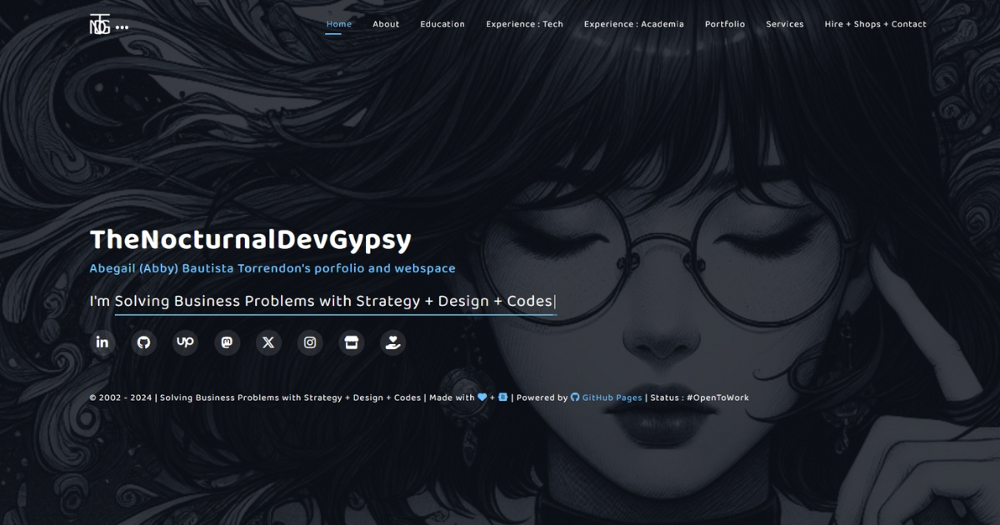

<h3 align="center">thenocturnaldevgypsy-io.github.io</h3>

<em>TheNocturnalDevGypsy : Porfolio and webspace of Abegail Bautista Torrendon</em>

<strong>You like the Repo? Don't forget to 🌟, 👁️, 🔱 and ❤️!</strong>

   
   
   
   
   
   
   
   

## 
This document contains the complete chronological list of updates and changes to the project

## 

Version Latest Live URL : https://thenocturnaldevgypsy-io.github.io/

| Version | Date | Commit | Type | Description |
| ------------- | ------------- | ------------- | ------------- | ------------- |
| 1.2.0 | 07.12.2024 | [a300c99](https://github.com/thenocturnaldevgypsy-io/thenocturnaldevgypsy-io.github.io/commit/a300c99ab5b6df1e432b9569c5da6f2b0de2ab81) for [PR 10](https://github.com/thenocturnaldevgypsy-io/thenocturnaldevgypsy-io.github.io/pull/10) | feat | - Updated the content of Portfolio section with the following: _TheNocturnalDevGypsy_, _Nightfall_, _Grypsyshards_, _Text to Art AI to NFT Collections @ uncut.network_ and _DHH Law Firm, Vietnam_. (for the ones with NDA, will be a different updates) - Updated `hire-and-contact.html` to reflect the GitHub Profile AMA Discussion - Updated `README.md` and `CHANGELOG.md` of the changes |
| 1.1.0 | 02.12.2024 | [2c372e6](https://github.com/thenocturnaldevgypsy-io/thenocturnaldevgypsy-io.github.io/commit/2c372e6e2d560b9b759f46c87cb900d427cae74d) for [PR 7](https://github.com/thenocturnaldevgypsy-io/thenocturnaldevgypsy-io.github.io/pull/7) | feat | - Updated the content of the following pages: Home, About, Education, Experience: Tech, Experience: Academia, Services, Hire + Shops + Contact - Omitted Portfolio in this update, as the scope is too big, it will be created into another Issue ticket under Feat. - Will be hiding the Portfolio link from all pages temporarily - Updated `README.md` and `CHANGELOG.md` of the changes |
| 1.0.0 | 12.11.2024 | [4a4796f](https://github.com/thenocturnaldevgypsy-io/thenocturnaldevgypsy-io.github.io/commit/4a4796f4930206392b32e509132b108da77fa34e) for [PR 5](https://github.com/thenocturnaldevgypsy-io/thenocturnaldevgypsy-io.github.io/pull/5) | feat | - Loaded all the needed vendor libraries in the `assets` directory - Created the needed template (`main.styles.css` and `main.core.js`) using Bootstrap - Done with coding the static page templates - Updated the repo's `README.md` |
| 0.0.5 | 20.10.2024 | [20542f7](https://github.com/thenocturnaldevgypsy-io/thenocturnaldevgypsy-io.github.io/commit/20542f706869b7a022c4267da02213e81439a92b) for [PR 2](https://github.com/thenocturnaldevgypsy-io/thenocturnaldevgypsy-io.github.io/pull/2), [Issue 3](https://github.com/thenocturnaldevgypsy-io/thenocturnaldevgypsy-io.github.io/issues/3), [ec8ecba](https://github.com/thenocturnaldevgypsy-io/thenocturnaldevgypsy-io.github.io/commit/ec8ecba86151a22cd6e0d47cf87e1dc596eb2ffa) | fix/feat | - Old GitHub account [@thenocturnaldevgypsy](https://github.com/thenocturnaldevgypsy) got flagged for no reason given, recreated the repo to the new account [@thenocturnaldevgypsy-io](https://github.com/thenocturnaldevgypsy-io) [[PR 2](https://github.com/thenocturnaldevgypsy-io/thenocturnaldevgypsy-io.github.io/pull/2)] - Renamed the repo from `thenocturnaldevgypsy.github.io` to `thenocturnaldevgypsy-io.github.io` - Redeployed at GitHub Pages, Live URL: https://thenocturnaldevgypsy-io.github.io [[Issue 3](https://github.com/thenocturnaldevgypsy-io/thenocturnaldevgypsy-io.github.io/issues/3)] - Updated the repo's documentation with the updated GitHub URLS except for the links under `CHANGELOG` [[ec8ecba](https://github.com/thenocturnaldevgypsy-io/thenocturnaldevgypsy-io.github.io/commit/ec8ecba86151a22cd6e0d47cf87e1dc596eb2ffa)]. - Details of the whole migration, see GitHub Project: [Migrating @thenocturnaldevgypsy to @thenocturnaldevgypsy-io](https://github.com/users/thenocturnaldevgypsy-io/projects/1/views/1) |
| 0.0.4 | 12.10.2024 | [074cb67](https://github.com/thenocturnaldevgypsy/thenocturnaldevgypsy.github.io/commit/074cb676a88b2f5deb55b9f3aafce66f819786b2) for [PR 4](https://github.com/thenocturnaldevgypsy/thenocturnaldevgypsy.github.io/pull/4), [0f11a17](https://github.com/thenocturnaldevgypsy/thenocturnaldevgypsy.github.io/commit/0f11a17277d48436d3adab759af0a3cef36d46ae) | feat | - Updated `.gitignore` and removed unnecessary folders and files - Updated the MD files with https://github.com/thenocturnaldevgypsy/github-md-template - Renamed style-main.css to main-style.css, core-main.js to main-core.js  |
| 0.0.3 | 09.09.2024 | [e7e94eb](https://github.com/thenocturnaldevgypsy/thenocturnaldevgypsy.github.io/commit/e7e94eb4495a1f626ca0f1ec4592b4f89c18a3de) | -- | Created necessary Markdown files for Repo's documentation. Updated README.md, created CHANGELOG.md |
| 0.0.2 | 01-08.09.2024 | -- | feat | - Created file and directory structure, setup the libary's framework and tools - Published Repo as Github Page (https://thenocturnaldevgypsy.github.io/), created a really simple "Coming Soon" page. |
| 0.0.1 | 01.09.2024 | [f49c384](https://github.com/thenocturnaldevgypsy/thenocturnaldevgypsy.github.io/commit/f49c384e35ebb578186b76162e5343958a583306) | -- | Initial Repo Commit |